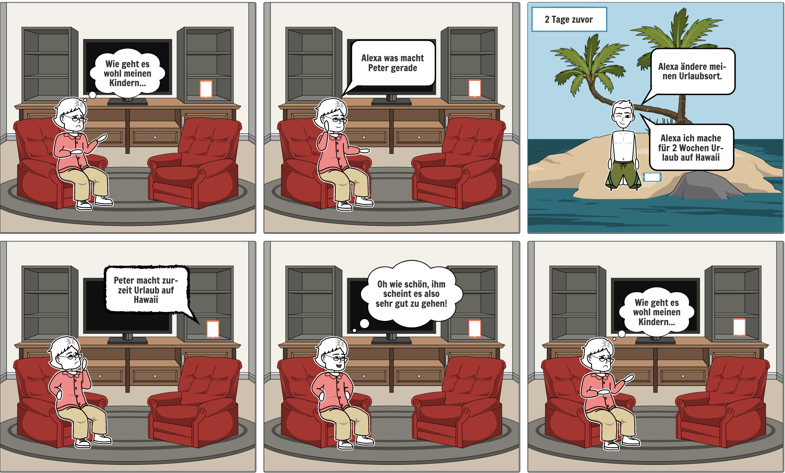

# DTLab Challenge WS 2019/20

Software Engineering I & [Alzheimer Gesellschaft München](https://www.agm-online.de/agm-home.html)

 **Team Di-1**
<object data="https://./swe-Di-01/Documents_Storyboard.pdf" type="application/pdf" width="700px" height="700px">
    <embed src="https://./swe-Di-01/Documents_Storyboard.pdf">
        
This browser does not support PDFs. Please download the PDF to view it: <a href="https://./swe-Di-01/Documents_Storyboard.pdf">Download PDF</a>.

    </embed>
</object>

[Press Release](swe-Di-01/Press.pdf)

[FAQs](swe-Di-01/FAQs.pdf)

 
 **Team Do-23**
 

 [Press Release](https://./swe-Di-23/Documents_Introducing_Shared_Activty_Memory.pdf)

[FAQs](https://./swe-Di-23/Documents_FAQ.pdf)