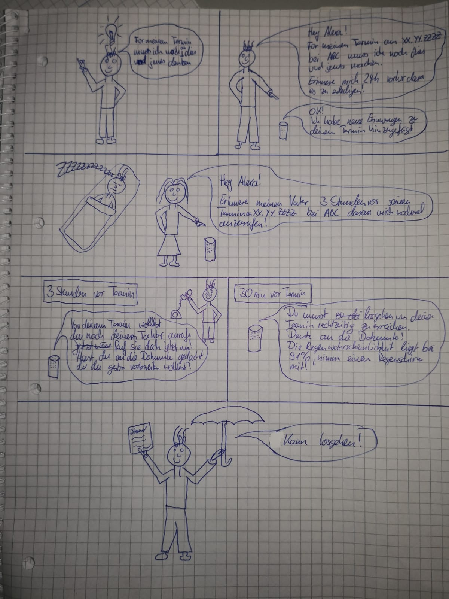

**Team Di-1 - Der Motivator**

*gehe aktiv und ohne Langeweile durch den Tag*

[Press Release](swe-Di-01/Documents_Press_Release.pdf)

[FAQ](swe-Di-01/Documents_FAQ.pdf)

**Team Di-2 - Abläufe**

*lass dir Schritt für Schritt Abläufe erklären und vergesse nichts mehr*

[Press Release](swe-Di-02/PR.pdf)

[FAQ](swe-Di-02/FAQ.pdf)

**Team Di-4 - Tagebuch**

*führe ein Sprach-Tagebuch und lass dir erzählen was du alles gemacht hast*

[Press Release](swe-Di-04/PR.pdf)

[FAQ](swe-Di-04/FAQ.pdf)

**Team Do-11 - Wo ist Walter**

*lass dir erzählen, was Freunde und Verwandte machen*

[Press Release und FAQ](swe-Do-11/PressRelease_FAQ.pdf)

**Team Do-12 - Daily Diary**

*erzähle Alexa deine Aktivitäten und rufe sie später wieder ab*

[Press Release](swe-Do-12/PR.pdf)

[FAQ](swe-Do-12/FAQ_Daily_Diary.pdf)

**Team Do-13 - Life4Alz**

*individuell konfigurierbare Gedächtnisstütze*

[Press Release](swe-Do-13/PR.pdf)

[FAQ](swe-Do-13/FAQ.pdf)

**Team Do-14 - Tages-Checkliste für die Pflege**

*Sprach-Protokoll für Pflegedienste und Angehörige: Jeder sagt was er/sie für den Betroffenen gemacht hat und nichts wird mehr vergessen oder zu viel gemacht*

[Press Release](swe-Do-14/PR.pdf)

[FAQ](swe-Do-14/FAQ.pdf)

**Team Do-15 - Der sprechende Terminkalender**

*Termine können von Betroffenen und Angehörigen im Google Kalender konfiguriert werden, Alexa erinnert an jeden Termin und alles was nicht vergessen werden darf*

[Press Release](swe-Do-15/PR.pdf)

[FAQ](swe-Do-15/FAQ.pdf)

**Team Do-16 - Decked-Out**

*werde erinnert, was du den Tag über so machen wolltest*

[Press Release](swe-Do-16/PR.pdf)

[FAQ](swe-Do-16/FAQ.pdf)

**Team Do-21 - Brainzheimer**

*effektives Gehirnjogging für Menschen mit Demenz*

[Press Release](swe-Do-21/PR.pdf)

[FAQ](swe-Do-21/FAQ.pdf)

**Team Do-22 - Wie heißt der Dings?**

*Interaktiv können gespeicherte Daten wie Namen und Geburts-
tage von Verwandten und Freunden abgefragt werden.*

[Press Release und FAQ](swe-Do-22/PR_FAQ.pdf)

 
**Team Do-23 - Shared Activity Memory**

*lass Dir erzählen was Familienmitglieder und Freunde gerade machen*

[Press Release](swe-Do-23/PR.pdf)

[FAQ](swe-Do-23/Documents_FAQ.pdf)

**Team Do-24 - Leave Home Savely**

*nichts vergessen, wenn man das Haus verlässt*

[Press Release](swe-Do-24/PR.pdf)

[FAQ](swe-Do-24/FAQ.pdf)

**Team Do-25 - Prozessabläufe**

*wie geht das nochmal?*

[Press Release](swe-Do-25/PR.pdf)

[FAQ](swe-Do-25/FAQ.pdf)
